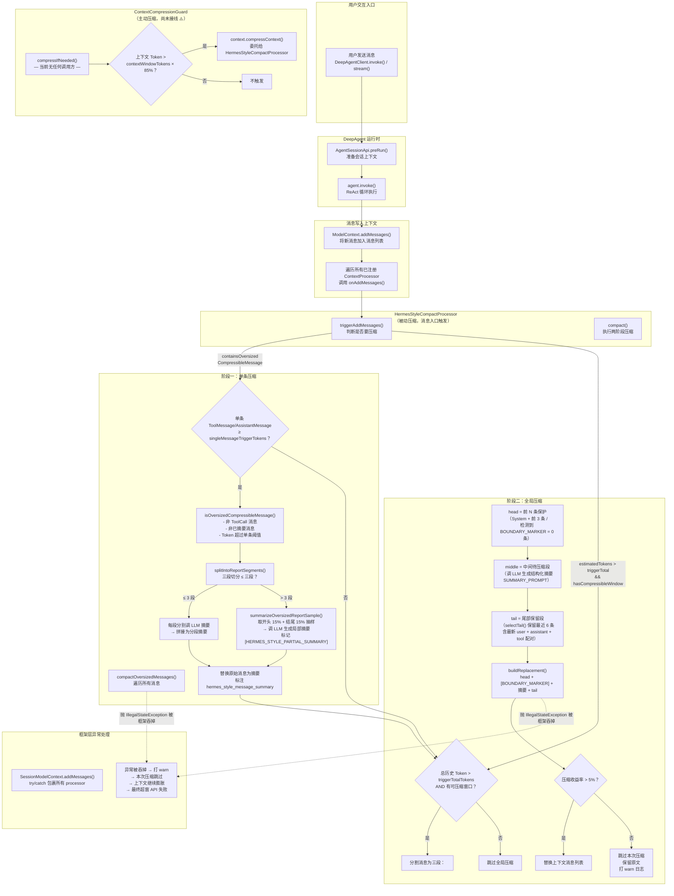
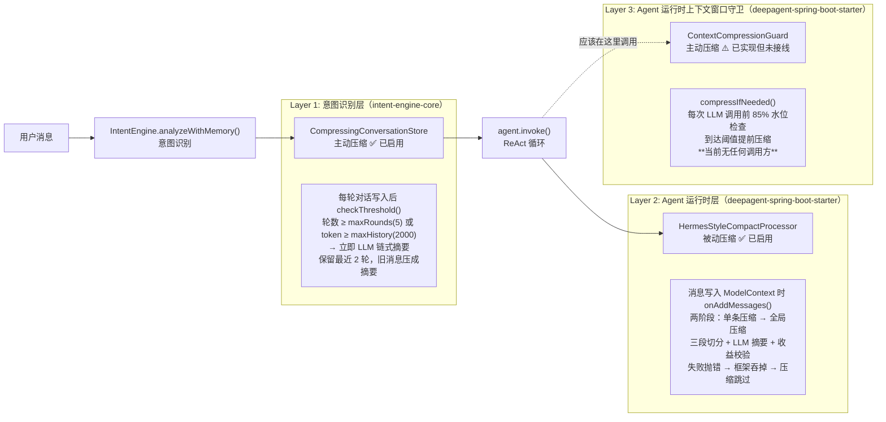

# DeepAgent Starter 上下文压缩触发流程

> 文档对应代码版本：`deepagent-spring-boot-starter` 0.1.12-SNAPSHOT

## 触发链路总览

用户的一条消息从发送到最终触发压缩，经历两个独立的压缩机制，分别在**不同时机**和**不同层级**工作。

## 三层压缩架构

项目的上下文压缩分为**三个独立层级**，分别在用户消息的不同处理阶段工作：

## Layer 1 vs Layer 2 vs Layer 3 对比

| 维度 | CompressingConversationStore | HermesStyleCompactProcessor | ContextCompressionGuard |
|---|---|---|---|
| **所属模块** | `intent-engine-core` | `deepagent-spring-boot-starter` | `deepagent-spring-boot-starter` |
| **触发时机** | 意图识别阶段，每轮对话写入后 | Agent 运行时，消息写入 ModelContext 时 | Agent 运行时，LLM 调用前 |
| **触发方式** | **主动** — checkThreshold() 每轮检查 | **被动** — onAddMessages() 由框架回调 | **主动** — compressIfNeeded() 外部调用 |
| **压缩对象** | 意图识别的对话历史（user/assistant 文本） | Agent 的完整上下文消息列表 | Agent 的 ModelContext |
| **触发条件** | 轮数 ≥ maxRounds(5) 或 token ≥ maxHistoryTokens(2000) | 单条 ≥ 2400 token 或 总计 ≥ 10400 token | 上下文占用 ≥ 窗口 85% |
| **压缩策略** | LLM 链式摘要，保留最近 2 轮 | 三段切分，头保护 + 中间 LLM 摘要 + 尾保留 | 委托给 HermesStyleCompactProcessor |
| **当前状态** | **已启用** ✅ | **已启用** ✅ | **已实现但未接线** ⚠️ |
| **失败行为** | LLM 失败 → 降级滑动窗口删旧消息 | 抛 IllegalStateException → 框架吞掉 → 压缩跳过 → 上下文持续膨胀 | 暂不生效 |

## 关键触发阈值

| 阈值 | 默认值 | 说明 |
|---|---|---|
| `singleMessageTriggerTokens` | `contextWindowTokens × singleMessageTriggerRatio`（~2400 token） | 单条 ToolMessage/AssistantMessage 超过此值触发单条压缩 |
| `triggerTotalTokens` | 可配置（默认 ~10400 token） | 整个历史累计超过此值触发全局压缩 |
| `HYGIENE_RATIO` | 0.85（85%） | `ContextCompressionGuard` 水位阈值（未接线） |
| `PROTECT_FIRST_MESSAGES` | 3 条 | 全局压缩时头部保护的消息数 |
| `MAX_MESSAGES_TO_KEEP` | 6 条 | 全局压缩时尾部保留的消息数 |
| `MIN_TAIL_MESSAGES` | 3 条 | 尾部最少保留消息数 |
| `MIN_MESSAGES_TO_SUMMARIZE` | 2 条 | 中间段最少待摘要消息数 |
| 收益率底线 | 5% | 压缩后收益低于此值则跳过本次压缩 |
| 摘要质量底线 | 120 字符 | 原文 ≥ 480 字符时摘要必须 ≥ 120 字符，否则抛错 |

## 阶段一：单条压缩（`compactOversizedMessages`）

遍历所有消息，对每一条判断是否需要进行单条压缩：

1. **判断条件**：`ToolMessage` 或 `AssistantMessage`（不含 tool_calls）且 token > `singleMessageTriggerTokens`
2. **三段切分**：将超长内容优先按换行切分成 ≤ 3 段，每段分别调 LLM 摘要
3. **抽样降级**：三段仍装不下时，取开头 15% + 结尾 15% 抽样，调 LLM 生成局部摘要，标记 `[HERMES_STYLE_PARTIAL_SUMMARY]`
4. **替换**：原始消息替换为摘要消息，标注 `hermes_style_message_summary` 元数据

## 阶段二：全局压缩（`compact`）

单条压缩后若总 token 仍超阈值，进入全局压缩：

1. **分割消息**：
   - **头部**：SystemMessage + 前 3 条（检测到 `[HERMES_STYLE_COMPACT_BOUNDARY]` 则头部保护降至 0 条）
   - **中间段**：头部之后、尾部之前的所有消息
   - **尾部**：保留最近 6 条，确保最新 user/assistant/tool_call↔tool_result 配对完整
2. **LLM 摘要**：中间段调 LLM 用 `SUMMARY_PROMPT` 生成结构化摘要，包含：历史任务快照、目标、约束、已完成动作、当前状态、阻塞、关键决策、已解决问题、相关文件等
3. **替换**：`head + [BOUNDARY_MARKER] + 摘要 + tail`
4. **收益校验**：压缩后 token 节省比例 < 5% 则跳过，保留原文

## 异常链路

文中三省（`ensureSummaryQuality`、`generateRequiredSummary`、`splitIntoReportSegments`）和汇总两处（`generateSummary`、`compactOversizedMessages` 中的 `summarizeOversizedMessage`）在失败时抛 `IllegalStateException`。

框架层 `SessionModelContext.addMessages()` 用 try/catch 包裹所有 processor，异常被吞掉后只打 warn，**本次压缩被跳过**，上下文原文保留继续膨胀。多次跳过后上下文必然撑爆窗口，最终导致 API 调用失败。

## 引用文档

- 详细分析见：[上下文工程全量梳理.md](上下文工程全量梳理【晓东梳理】.md)
- 代码位置：`deepagent-spring-boot-starter/src/main/java/.../context/`
  - `HermesStyleCompactProcessor.java`
  - `ContextCompressionGuard.java`
  - `DeepAgentContextProcessorResolver.java`
