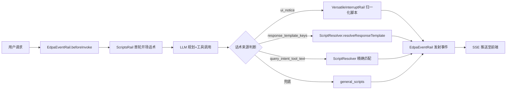

# EDPAgent 思维链话术与固定帧替换 转测试设计文档

> 基于《FEAT_EDPA 话术特性用例文档 v1.3》生成。涵盖业务场景话术、工具集话术、固定帧话术三大模块的测试设计。

## 1. 背景与目标

### 背景

- **当前问题**：金融行业合规要求，模型原始输出 token 不能直接面客；动态规划过程中需向用户呈现可读、可控的思维链话术
- **影响范围**：EDPAgent 全部事件流（tool_start/tool_end/todo_start/todo_end/todolist/interrupt_start/首轮开场/取消/超范围），以及大模型思考 token 流
- **需求来源**：EDPAgent 话术特性需求规格 + 澄清收敛（Q1-Q12 共 12 项已全部收敛）

### 目标

- 目标 1：12 个默认兜底话术键全部可输出，优先级链（任务级→兜底）严格生效
- 目标 2：固定帧替换功能按 chars_per_frame/tokens_between_frames/min_interval_ms 配置逐帧推送
- 目标 3：Skill 脚本可通过 ui_notice 主动送出事件话术，优先级最高
- 目标 4：ask_user 工具话术按 dict + status 查找，变量用 safe_format 渲染

### 非目标

- 非目标 1：不测试 EDPAgent 动态规划算法本身（任务编排/工具选择逻辑）
- 非目标 2：不测试 LLM 模型推理性能与质量
- 非目标 3：不测试前端渲染细节（仅约束推送内容与节奏）
- 非目标 4：不测试多租户/权限模型

## 2. 场景、规则与约束

### 核心场景

| 场景 | 触发条件 | 预期结果 |
|---|---|---|
| 100元理财购买 | 用户输入"推荐理财"→选品→100元→确认→确认 | 话术: tool_start/end、product_recommend_success、product_select_confirm、fund_planning_success |
| 20000元理财购买 | 同上，金额=20000 | 增加转账补齐话术，最终购买成功 |
| 100万元理财购买 | 同上，金额=1000000 | 话术: fund_planning_wealth_insufficient(tool_end)、fund_planning_both_insufficient(interrupt_start) |
| 取消流程 | 用户输入"推荐理财"→"取消" | 话术: cancel_confirm→task_cancelled |
| 超范围请求 | 用户输入"帮我订机票" | 话术: out_of_scope |
| 固定帧替换 | think_chunk_mode=fixed_script | think_chunk 按固定帧推送，非真实 token |
| ask_user 询问 | LLM 调用 ask_user | interrupt_start 事件输出对应话术 |
| ui_notice 注入 | 归一化脚本返回 ui_notice | ui_notice 优先于 response_template_keys |

### 关键规则

| 规则 | 说明 |
|---|---|
| 话术优先级链 | ui_notice > response_template_keys > query_intent_tool_text > general_scripts 兜底 |
| 精确匹配 | query_intent_tool_text 按 query_intent 精确匹配（完全相等才命中，大小写/空白敏感） |
| response_template_keys 数组格式 | call_versatile: [成功key, 失败key]，status="success"取[0]，非success取[1] |
| response_template_keys dict格式 | ask_user: {"status": "key"}，按 status 在 dict 中查找 |
| safe_format vs resolve | resolve() 缺失变量保留{var}占位符（UC-A06）；safeFormat() 缺失变量替换为空串（UC-A07） |
| 固定帧不切分 | ui_notice/response_template/ask_user 话术不经固定帧切分，一次性推送 |
| planning_start 触发 | **以代码实现为准**：Java 版在 todo_create 检测时和 PLAN_FIRST_BLOCK 时均标记发射 planning_start（非仅首轮） |
| request_start 首轮守卫 | **以代码实现为准**：Java 版 request_start 在 beforeInvoke 中直接无条件发射（`KEY_PENDING_REQUEST_START` 常量已定义但从未使用），续轮也会发出 request_start |
| 两步取消流程 | ask_user(cancel_confirm) → cancel_task(task_cancelled)，中间有用户二次确认 |
| 固定帧阶段切换 | planning→executing→resuming，阶段切换时上一阶段子帧冲刷完毕后再切换 |

### 关键约束

| 约束 | 说明 | 影响 |
|---|---|---|
| 固定帧不支持热切换 | enabled/think_chunk_mode 运行中修改不影响当前会话，需重启 | 配置变更需重启 Agent |
| 配置加载 fail-fast | 兜底话术文件加载失败时启动期阻断 | Agent 无法启动 |
| 归一化脚本输出格式 | 兼容两种格式：[status, dict] 数组 + {dict} 单对象 | 脚本输出格式不匹配时走 fallback |
| interrupt_source | 默认 "script"，追问内容必须来源脚本 | LLM 生成内容被拒绝 |

### 待确认点

| 问题 | 影响 | 当前处理 |
|---|---|---|
| UC-C05 planning_start/isFirstTurn 与特性文档不一致 | 特性文档要求"仅首轮成对发出"，Java 代码续轮也发 request_start，planning_start 在 todo_create 时触发 | **以代码实现为准**，测试按代码行为验证 |

## 3. 总体方案

### 方案概述

1. **入口**：用户请求通过 A2A JSON-RPC `/a2a` 接口进入 EdpaEventRail
2. **核心处理**：ScriptResolver 解析话术优先级链，EdpaEventRail/VersatileInterruptRail 发射事件
3. **数据读写**：scriptconfig.yaml（兜底+场景级）、SKILL.yaml（skill级）、归一化脚本输出（ui_notice）
4. **下游生效**：SSE artifactUpdate 推送至前端，content 为话术文本

### 链路图

### 模块分工

| 模块 | 职责 | 输入 | 输出 |
|---|---|---|---|
| EdpaEventRail | 事件发射（beforeInvoke/afterModelCall/afterToolCall/afterInvoke） | Agent 回调上下文 | SSE artifactUpdate 事件 |
| VersatileInterruptRail | call_versatile 拦截、归一化脚本执行、ui_notice 提取 | tool_args | toolResult + ui_notice |
| ScriptResolver | 话术优先级解析、模板变量渲染 | 话术配置 + 事件上下文 | 渲染后话术文本 |
| ScriptsRail | 首轮开场话术（request_start/planning_start） | beforeInvoke 上下文 | interrupt_start 事件 |
| AskUserTemplateRail | ask_user 拦截、response_template 查找 | tool_args | interrupt_start 事件 |
| CancelRail | cancel_task 拦截、task_cancelled 话术 | cancel_task reason | interrupt_start 事件 |

## 4. 关键设计

| 设计点 | 处理方式 | 异常/边界 |
|---|---|---|
| 话术优先级链 | ui_notice > response_template_keys > query_intent_tool_text > general_scripts | 链中任一层未命中时降级到下一层，不阻断 |
| 归一化脚本输出解析 | 兼容 [status, dict] 数组 + {dict} 单对象两种格式 | 非数组非对象时走 fallback，ui_notice 丢失 |
| ui_notice 传递 | 归一化后 ui_notice 放回 toolResult（在 setToolMsg 之后），EdpaEventRail 从 toolResult 读取 | setToolMsg 用不含 ui_notice 的版本构建，LLM 不可见 |
| UC-A06 变量缺失 | resolve() 保留 {var} 占位符原样 | 与 UC-A07 safeFormat() 替换为空串区分 |
| tokens_between_frames 节流 | 用 LLM content 长度估算 token 数，按阈值逐帧推送 | tokens_between_frames=0 时不节流，整批推送 |
| planning_start 触发（以代码为准） | todo_create 检测时标记发射 + PLAN_FIRST_BLOCK 时标记 | 续轮也可能发出 planning_start |
| request_start 首轮守卫（以代码为准） | beforeInvoke 中直接无条件发射（KEY_PENDING_REQUEST_START 未使用） | 续轮也会发 request_start |

### 接口说明

| 接口/调用 | 类型 | 调用方 | 入参要点 | 字段约束/默认值 | 出参/事件 | 错误或异常 |
|---|---|---|---|---|---|---|
| POST /a2a | HTTP(SSE) | 前端/测试脚本 | JSON-RPC SendStreamingMessage | contextId 必填 | SSE artifactUpdate | 参数非法返回 400 |
| SKILL_INPUT 环境变量 | 环境变量 | 归一化脚本 | JSON 字符串 | query_intent/query_description/notice_context | stdout JSON | 脚本超时走 fallback |
| scriptconfig.yaml | 配置文件 | SysScriptsConfig | YAML 格式 | 启动时加载 | 话术模板 | 格式错误 fail-fast |
| SKILL.yaml | 配置文件 | SkillScriptsCollector | YAML 格式 | 启动时加载 | skill 级话术 | 格式错误跳过该 skill |

### 配置说明

| 配置项 | 所在位置 | 默认值 | 生效时机 | 影响范围 | 回滚/关闭方式 |
|---|---|---|---|---|---|
| think_chunk_mode | scriptconfig.yaml | real_stream | 启动时 | think_chunk 事件 | 改回 real_stream 重启 |
| think_chunk_fixed_scripts.enabled | scriptconfig.yaml | true | 启动时 | 固定帧开关 | 设为 false 重启 |
| chars_per_frame | scriptconfig.yaml | 4 | 启动时 | 帧切分粒度 | 改值重启 |
| tokens_between_frames | scriptconfig.yaml | 2 | 启动时 | 帧推送节奏 | 改值重启 |
| min_interval_ms | scriptconfig.yaml | 50 | 启动时 | 帧间隔 | 改值重启 |
| interrupt_source | scriptconfig.yaml | script | 启动时 | 中断追问来源 | 改为 llm 重启 |
| EDP_AGENT_MODEL_API_KEY | 环境变量 | — | 启动时 | LLM 调用 | 设置环境变量重启 |

## 5. 可观测性

### 观测点

| 观测点 | 日志/指标/状态 | 用途 |
|---|---|---|
| [EDPA-DIAG] normalize done | run.log | 归一化脚本执行结果（status/uiNotice/keys） |
| [EDPA-DIAG] emit tool_end | run.log | tool_end 话术发射内容及来源 |
| [EDPA-DIAG] uiNoticeText=SET | run.log | ui_notice 是否成功传递到 EdpaEventRail |
| SSE artifactUpdate | 前端/采集脚本 | 事件类型和话术内容 |
| SysScriptsConfig loaded | run.log | 话术模板加载数量和来源 |
| Skill scripts collected | run.log | skill 级话术数量 |
| [EDPA-DIAG] sid= phase= -> fixed_frame think | run.log | 固定帧阶段选择和帧数 |

## 6. 测试建议

### 建议测试重点与开发自测门禁

| 前置/触发条件 | 建议测试重点 | 希望保证的结果 | 优先级建议 | 建议测试方式 | 是否开发自测门禁 |
|---|---|---|---|---|---|
| 未配置自定义话术 | UC-A01: 12个兜底话术键全部输出 | tool_start/tool_end/todo_start/todo_end/todolist_start/end/interrupt_start/request_start/planning_start/task_cancelled/cancel_confirm/out_of_scope 全覆盖 | P0 | 端到端 | 是 |
| query_intent="查询账户余额" | UC-A03: 精确匹配命中 | tool_start="正在查询账户余额..." | P0 | 端到端 | 是 |
| query_intent="理财购买" vs "理财选品购买" | UC-A03: 互不误命中 | 精确匹配，"理财购买"不命中"理财选品购买" | P0 | 端到端 | 是 |
| query_intent 未命中 | UC-A03: 降级链 | 降级到 general_scripts.tool_start，{tool_name} 变量渲染 | P0 | 端到端 | 是 |
| 归一化脚本 status="success" | UC-A04: 成功话术 | 取 response_template_keys[0] 对应话术 | P0 | 端到端 | 是 |
| 归一化脚本 status!="success" | UC-A04: 失败话术 | 取 response_template_keys[1] 对应话术 | P0 | 端到端 | 是 |
| 归一化脚本返回 ui_notice | UC-A05: ui_notice 优先 | ui_notice 优先于 response_template_keys，跳过 keys 机制 | P0 | 端到端 | 是 |
| tool_start 模板含 {tool_name} | UC-A06: 变量渲染 | {tool_name} 正确替换为工具名 | P0 | 端到端 | 是 |
| tool_start 变量缺失 | UC-A06: 保留占位符 | 输出保留 {var} 原样文本 | P1 | 单测 | 否 |
| ask_user status="confirm" | UC-A07: 确认话术 | 输出确认话术，selected_product 被写入 | P0 | 端到端 | 是 |
| ask_user status="cancel_confirm" | UC-A07: 取消确认话术 | 输出"确认要取消当前操作吗？" | P0 | 端到端 | 是 |
| ask_user 变量缺失 | UC-A07: 替换为空串 | safeFormat 缺失变量替换为空串（非保留占位符） | P1 | 单测 | 否 |
| think_chunk_mode=fixed_script | UC-B01: 固定帧启用 | think_chunk 输出固定帧话术，非真实 token | P0 | 端到端 | 是 |
| think_chunk_mode=real_stream | UC-B01: 固定帧关闭 | think_chunk 输出真实 token | P1 | 端到端 | 否 |
| 用户输入含"推荐" | UC-B02: 关键字命中 | 命中推荐类话术 | P0 | 端到端 | 是 |
| 场景级query_patterns覆盖框架级 | UC-B02: 同key覆盖 | 场景级同key时覆盖框架级，不合并 | P1 | 端到端 | 否 |
| chars_per_frame=4 | UC-B03: 帧切分 | 4字一帧 | P0 | 端到端 | 是 |
| tokens_between_frames=2 | UC-B03: token节流 | 每2个token推一帧 | P0 | 端到端 | 是 |
| min_interval_ms=50 | UC-B03: 间隔限速 | 帧间隔≥50ms | P1 | 端到端 | 否 |
| planning→executing 阶段切换 | UC-B04: 阶段化话术 | planning 用 default_scripts，executing 用 execution_scripts | P0 | 端到端 | 是 |
| 阶段化字段全空 | UC-B05: 向后兼容 | 降级到 scripts 字段 | P1 | 单测 | 否 |
| todo_create 触发 | UC-C05: planning_start（以代码为准） | planning_start 在 todo_create 检测时标记发射 | P1 | 端到端 | 否 |
| 续轮请求 | UC-C05: request_start（以代码为准） | 续轮也发出 request_start（beforeInvoke 无条件发射，无 isFirstTurn 守卫） | P1 | 端到端 | 否 |
| 用户取消 | UC-C03: 两步取消 | cancel_confirm→task_cancelled，Agent 循环终止 | P0 | 端到端 | 是 |
| 超范围请求 | UC-C04: out_of_scope | 输出"正在学习中，暂不支持该业务。" | P1 | 端到端 | 否 |

### 关键异常与边界

- 归一化脚本输出非数组非对象格式时走 fallback，ui_notice 丢失（需验证不阻断主流程）
- 归一化脚本执行超时时降级透传原始业务数据，status 视为非 success
- response_template_keys 为空时不输出结果话术
- 话术 key 在配置中未找到时记录 warn 日志，不阻断
- chars_per_frame=0 时整句一次性推送
- tokens_between_frames=0 时不按 token 节流
- LLM token 流提前结束时剩余子帧立即冲刷输出
- enable_resume_scripts=false 时 resuming 阶段不输出固定话术也不输出真实 token
- 规划失败时仅输出 todolist_start，无 todolist_end
- interrupt 超时后链接断开，不输出任何话术

## 附录
