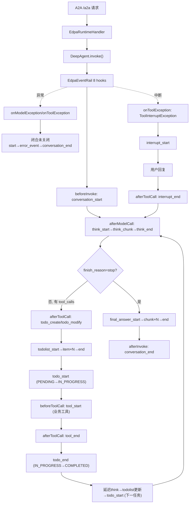

# 转测试设计文档 — EDPA 动态规划思维链特性

> 本文档基于《FEAT_EDPA 动态规划思维链特性用例.md》需求文档及 `edp-agent-java` 代码实现编写，遵循《转测试设计文档模板》结构。

## 1. 背景与目标

### 背景

- **当前问题**：EDPAgent 原有事件流仅支持 5 种粗粒度事件（todo_start/todo_end/purchase_confirm/error），无法向前端完整呈现智能体"思考→规划→执行→观察→回答"的全过程，用户无法感知 Agent 当前处于哪个阶段。
- **影响范围**：前端思维链渲染、用户交互体验、排障可观测性。所有通过 A2A SSE 接入 EDPAgent 的前端客户端均受影响。
- **需求来源**：EDPAgent v1.1 动态规划思维链特性需求，要求通过 SSE 向前端实时推送 21 种标准化事件。

### 目标

- 目标 1：实现 21 种标准化思维链事件（含 todo_status / tool_status 中间状态预留枚举），通过 SSE 流式推送至前端。
- 目标 2：实现 ReAct 循环事件序列，每轮 = Think（推理）→ Plan（更新 todolist）→ Act（todo + tool）→ Observe（进入下一轮 Think）。
- 目标 3：实现事件配对规则——conversation_start↔end、think_start↔end、tool_start↔end、todolist_start↔end、todo_start↔end、interrupt_start↔end，异常时"像关括号一样"闭合未关闭的 start。
- 目标 4：实现 error_event 异常分类（LLM_TIMEOUT / LLM_AUTH_ERROR / INVALID_TOOL_OUTPUT / TOOL_TIMEOUT / DEPENDENCY_VIOLATION / INTERNAL_ERROR），error_event 后始终跟 conversation_end。
- 目标 5：实现 EdpaEventStreamAdapter 将内部 custom OutputSchema 转为 A2A SSE 帧并抑制重复的 llm_output 裸流。

### 非目标

- 非目标 1：本次不实现 Checkpoint Redis 持久化（阶段 5 T5.9），断线重连的完整事件回放不在本次范围。
- 非目标 2：本次不实现超时/熔断/降级保护机制（阶段 5 T5.4-T5.6），仅实现错误事件输出。
- 非目标 3：本次不实现 metrics 事件。
- 非目标 4：本次不实现 WebSocket / 轮询接入方式，仅支持 SSE。

## 2. 场景、规则与约束

### 核心场景

| 场景 | 触发条件 | 预期结果 |
|---|---|---|
| 正常对话全链路（UC-01） | 用户发送涉及多步 Skill 串联的请求（如"推荐并购买理财产品"） | 完整输出 conversation_start→think→todolist→todo→tool→…→final_answer→conversation_end 事件序列 |
| 多步任务动态规划与依赖校验（UC-02） | edp-config.yaml 配置了含 depends_on 的任务列表，用户发起多步请求 | LLM 选择任务子集，校验依赖完整性，拓扑排序生成执行顺序 |
| 任务重新规划 re-plan（UC-03） | 执行过程中 LLM 观察结果发现需要追加/调整步骤 | 覆盖式更新 todolist，已完成项保留 COMPLETED 状态 |
| 业务工具调用事件（UC-04） | 任务执行中 LLM 决定调用 call_mcp 或 call_versatile | todo_start→tool_start→tool_status(可选)→tool_end→todo_end 嵌套结构 |
| LLM 推理流式 think_chunk（UC-05） | think_start 已发送，LLM API 支持流式输出 | afterModelCall 中发射 think_start→think_chunk(content)→think_end |
| 最终回答流式输出（UC-06） | 所有任务完成，LLM 决定输出最终答案（finish_reason=stop 无 tool_calls） | final_answer_start→final_answer_chunk(×N)→final_answer_end→conversation_end |
| 追问中断与恢复（UC-07） | 任务执行中需要用户确认，ask_user 工具被调用 | onToolException 拦截 ToolInterruptException→interrupt_start，用户回复后 interrupt_end |
| 任务取消终止（UC-08） | 用户表达终止意图，LLM 调用 cancel_task | cancel_confirm→用户确认→task_cancelled→conversation_end |
| SSE 连接断开处理（UC-09） | 客户端网络断开，SSE 连接中断 | 服务端保存 checkpoint，后台 Agent 执行线程继续完成 |
| LLM 调用超时/失败（UC-10） | LLM API 不可用或响应超时 | onModelException→error_event(LLM_TIMEOUT/LLM_AUTH_ERROR)→conversation_end |
| 任务依赖冲突检测（UC-11） | LLM 输出的 todo 列表违反 depends_on 约束 | error_event(DEPENDENCY_VIOLATION)→conversation_end |
| 超范围业务拒绝（UC-12） | 用户请求超出 scope.allowed 范围 | interrupt_start(out_of_scope)，不进入 todolist_start |
| 前端断线重连续接（UC-13） | SSE 连接断开后前端携带同一 conversation_id 发起新请求 | 服务端从 checkpoint 恢复会话 |
| 多轮对话上下文保持（UC-14） | 第一轮对话完成后前端在同一 conversation_id 发起新请求 | 第二轮引用第一轮结果，已完成步骤保留 COMPLETED |

### 关键规则

| 规则 | 说明 |
|---|---|
| Rule 1：conversation 配对 | conversation_start ↔ conversation_end 1:1，异常时 onModelException/onToolException 发 conversation_end |
| Rule 2：think 严格配对 | 每轮 LLM 推理发一对 think_start/think_end，afterModelCall 发 think_start 前置 thinkOpen=true，发 think_end 后置 false |
| Rule 3：think_end 在 final_answer_start 之前 | finish_reason=stop 时先发 think_end，再发 final_answer_start |
| Rule 5：todo 状态转移 | PENDING/null→IN_PROGRESS 发 todo_start；IN_PROGRESS→COMPLETED/DONE 发 todo_end{completed}；IN_PROGRESS→CANCELLED 发 todo_end{cancelled} |
| Rule 6：tool 配对 | 仅业务工具（call_versatile/call_mcp）发 tool_start/tool_end；todo_create/todo_modify/ask_user/read_file 不发 |
| Rule 7：interrupt 跨轮配对 | onToolException 拦截 ToolInterruptException→interrupt_start（本轮末）；下轮 afterToolCall ask_user 恢复→interrupt_end |
| Rule 8：异常不破坏配对 | 所有已打开的 start 必须先发对应 end 关闭，再发 error_event，最后 conversation_end |
| Rule 9：conversation_start 不发跨轮 todolist | beforeInvoke 只静默初始化 todo 状态追踪，不发 todolist 事件 |
| Rule 10：todo_end 转移 todolist 在 todo_end 之后 | IN_PROGRESS→COMPLETED 时先发 todo_end，后发 todolist |
| Rule 11：todo_start 转移 todolist 在 todo_start 之前 | PENDING→IN_PROGRESS 时先发 todolist，后发 todo_start |
| Rule 12：todolist 逐条发送 | N 条 todo = N 个 todolist_item 事件，每个携带单条 todo（非 tasks 数组） |
| 延迟 think 规则 | 当 LLM 本轮只调用 todo_modify（无业务工具）时，think 延迟到 todo_end 之后发射，使事件流为 tool_end→todo_end→think→todolist |
| think_chunk 内容回退 | reasoning_content 仅为标点占位（如 "." / "。"）时，length≤1 视为无数据，回退到 content（LLM 实际输出） |
| planning_start 去重 | per-request 只发一次，触发条件：afterModelCall 检测到 todo_create |

### 关键约束

| 约束 | 说明 | 影响 |
|---|---|---|
| 传输协议 | 仅 SSE 流式响应 | 不支持 WebSocket / 轮询 |
| 接入方式 | A2A JSON-RPC `/a2a` | 不支持 RESTful / WebSocket 等非 A2A 协议 |
| 事件类型 | 20 种标准化事件（EdpaEventType 枚举） | 禁止在代码中使用字符串字面量作为事件类型 |
| 工具事件范围 | 仅 call_mcp / call_versatile 发 tool 事件 | ask_user/cancel_task/skill_tool/read_file/bash 不发 |
| Rail 优先级 | EdpaEventRail priority=80，低于 TaskPlanningRail(90) | 保证 afterToolCall 时读取刷新后的 todo 缓存 |
| 最大并发 SSE | ≥ 500 | 单实例支持的并发连接数 |
| 单次对话超时 | 300s | conversation 从开始到 conversation_end 的最大时长 |
| LLM 调用超时 | 60s，最多重试 3 次 | 超时后触发 error_event(LLM_TIMEOUT) |
| 工具执行超时 | 30s | 超时后 tool_end 含 TIMEOUT 错误信息 |
| 事件顺序保证 | 严格有序 | SSE 事件按发射顺序到达前端，不乱序 |


## 3. 总体方案

### 方案概述

1. **入口**：A2A JSON-RPC `/a2a` 请求，EdpaRuntimeHandler 接收并创建 DeepAgent 执行实例。
2. **核心处理**：EdpaEventRail（priority=80）通过 8 个 AgentRail hook（beforeInvoke/afterInvoke/beforeModelCall/afterModelCall/beforeToolCall/afterToolCall/onModelException/onToolException）拦截全生命周期，发射 21 种事件。
3. **数据读写**：事件通过 `ctx.getSession().writeStream(OutputSchema("custom", 0, eventMap))` 写入 Core 流管道；todo 数据通过 TodoTool 落盘文件读写（.todo 目录）。
4. **对下游生效**：EdpaEventStreamAdapter 将 custom OutputSchema 转为 A2A SSE `AgentExecutionResult.output(json, Target.USER)` 帧，抑制重复的 llm_output 裸流。

### 链路图 / 流程图



### 模块分工

| 模块 | 职责 | 输入 | 输出 |
|---|---|---|---|
| EdpaEventRail（rail/EdpaEventRail.java） | 统一事件发射 Rail，通过 8 个 hook 拦截全生命周期发射 21 种事件 | AgentCallbackContext（sessionId/inputs/response/toolResult/exception） | OutputSchema("custom", eventMap) 写入 session 流 |
| EdpaEventStreamAdapter（enhancer/EdpaEventStreamAdapter.java） | custom OutputSchema → A2A SSE 帧；抑制 llm_output 重复 | OutputSchema 流 | AgentExecutionResult.output(json, Target.USER) 流 |
| EdpaRuntimeHandler（handler/EdpaRuntimeHandler.java） | 运行时入口，创建 DeepAgent、注册 Rail、覆写 resultAdapter | A2A 请求 + Spring Boot 配置 | DeepAgent 实例 + StreamAdapter |
| EdpaEventType（config/EdpaEventType.java） | 事件类型枚举（唯一来源） | — | wireName 字符串 |
| TodoSessionResolver（enhancer/TodoSessionResolver.java） | sessionId 转义（多会话隔离） | 原始 sessionId | 转义 sessionId |
| EdpaTodoRail（rail/EdpaTodoRail.java） | 任务预加载 | edp-config.yaml todolist_steps | todo_create 注入 |
| McpInterruptRail（rail/McpInterruptRail.java） | call_mcp 脚本执行 + 超时 + JSON 校验 | call_mcp 工具调用 | 脚本 JSON 结果 / TIMEOUT 错误 |
| VersatileInterruptRail（rail/VersatileInterruptRail.java） | call_versatile 委托调用 + 中断恢复 | call_versatile 工具调用 | Versatile 响应 / ToolInterruptException |

## 4. 关键设计

| 设计点 | 处理方式 | 异常/边界 |
|---|---|---|
| think_chunk 内容来源 | afterModelCall 中优先取 reasoning_content（推理模型），length≤1 视为占位符回退到 content（非推理模型） | reasoning 和 content 均为空时跳过 think_chunk（think_start→think_end 空对） |
| 延迟 think 发射 | isOnlyTodoModify 判定本轮 LLM 只调 todo_modify 时，think 延迟到 afterToolCall 的 todo_end 之后发射 | 兜底：afterToolCall 末尾检查 KEY_PENDING_THINK 仍未发射则补发 |
| todolist 指纹去重 | fingerprint(todos) 对比 lastTodolistFingerprint，仅变化时发 todolist_start/item/end | todos 为空时跳过整组事件 |
| todolist 逐条发送（Rule 12） | emitTodolistPerItem 发 todolist_start→item{单条}×N→todolist_end | N 条 todo = N 个 item 事件 |
| todo 状态转移事件 | hasEnd（IN_PROGRESS→COMPLETED/CANCELLED）先发 todo_end；hasStart（PENDING→IN_PROGRESS）后发 todo_start | 路径切换（PENDING→CANCELLED）只发 todolist 不发 todo_start/end |
| error_type 异常分类 | classifyModelError：BaseError.StatusCode→cause 类型→message 文字匹配→兜底 INTERNAL_ERROR；classifyToolError：timeout/json/depend 文字匹配 | 无法分类时兜底 INTERNAL_ERROR |
| ToolInterruptException 中断识别 | onToolException 递归检查 cause 链找到被包装的 ToolInterruptException | RuntimeException 包装的 ToolInterruptException 需递归解包 |
| interrupt_id 生成 | onToolException 中 UUID.randomUUID().toString()，存入 interruptIdMap | 跨轮持久化，afterToolCall interrupt_end 取出，afterInvoke 兜底清理 |
| llm_output 抑制 | EdpaEventStreamAdapter.mapResult 中 llm_output 类型返回 null（filter 过滤） | 防止 think_chunk/final_answer_chunk 与裸流文本重复 |
| conversationClosed 防重入 | emitConversationEnd 检查 conversationClosed 标记，异常处理已发则 afterInvoke 跳过 | 避免重复 conversation_end |

### 接口说明

| 接口/调用 | 类型 | 调用方 | 入参要点 | 字段约束/默认值 | 出参/事件 | 错误或异常 |
|---|---|---|---|---|---|---|
| POST /v1/{project_id}/agents/{agent_id}/conversations/{conversation_id} | HTTP SSE | 前端客户端 | query（用户问题）、conversation_id、stream=true | stream 必须为 true；timeout 默认 300s | 22 种 SSE 事件流 | LLM_TIMEOUT / LLM_AUTH_ERROR / TOOL_TIMEOUT / INVALID_TOOL_OUTPUT / DEPENDENCY_VIOLATION / INTERNAL_ERROR |
| ctx.getSession().writeStream(OutputSchema) | SDK | EdpaEventRail | type="custom", payload=Map{event,timestamp,conversation_id,...} | type 固定 "custom" | 流管道消费 | writeStream 异常时 warn 日志，不中断 |
| EdpaEventStreamAdapter.adapt(Stream) | SDK | EdpaRuntimeHandler | rawResults Stream（OutputSchema） | — | AgentExecutionResult 流 | null 结果被 filter 过滤 |

### 配置说明

| 配置项 | 所在位置 | 默认值 | 生效时机 | 影响范围 | 回滚/关闭方式 |
|---|---|---|---|---|---|
| edp.agent.scenario-home | application.yml | scenarios/wealth-demo | 启动时 | 场景配置加载路径 | 修改配置重启 |
| actrule.maxSteps | governance/actrule.yaml | 15 | 启动时 | ReAct 循环最大轮次 | 调回旧值 |
| actrule.tool_limits | governance/actrule.yaml | 各工具默认 100 | 启动时 | 单工具调用次数上限 | 调回旧值 |
| model.timeout | application.yml | 60s | 启动时 | LLM 调用超时 | 调回旧值 |
| versatile.timeout | application.yml | 30s | 启动时 | Versatile 工具超时 | 调回旧值 |
| todolist_steps | scenario-config.yaml | 4 步（推荐/筛选/选择/购买） | 启动时 | 任务规划步骤 | 修改配置重启 |
| todolist.entries.depends_on | scenario-config.yaml | 链式依赖 | 启动时 | 任务依赖关系 | 修改配置重启 |

## 5. 可观测性

### 观测点

| 观测点 | 日志/指标/状态 | 用途 |
|---|---|---|
| [EDPA-DIAG] 前缀日志 | INFO 级别，beforeInvoke/afterModelCall/beforeToolCall/afterToolCall/onModelException/onToolException/afterInvoke 各 hook 入口 | 追踪事件发射路径，定位事件流与预期不一致的偏离点 |
| [EDPA-DIAG] MODEL_RESPONSE | INFO 级别，finish_reason/toolCalls/toolNames/reasoningPreview/contentPreview/todos | 记录 LLM 响应关键信息，诊断 think_chunk 内容来源 |
| [EDPA-DIAG] emitTodoEvents | INFO 级别，todos 数量/fpChanged/prev/new 指纹 | 追踪 todolist 状态转移判定（hasEnd/hasStart/hasPathSwitch） |
| EdpaEventRail emit '{}' | INFO 级别，事件 wireName | 确认每个事件实际发射 |
| SSE 事件流 | 前端收到的事件序列 | 验证事件配对、顺序、内容 |
| .todo/{sessionId}/todo.json | TodoTool 落盘文件 | 验证 todo 状态持久化（COMPLETED/IN_PROGRESS/TODO） |
| engine/logs/run/*.log.gz | 运行日志文件 | 排查失败原因、异常堆栈 |

## 6. 测试建议

### 建议测试重点与开发自测门禁

| 前置/触发条件 | 建议测试重点 | 希望保证的结果 | 优先级建议 | 建议测试方式 | 是否开发自测门禁 |
|---|---|---|---|---|---|
| 用户发起涉及多步 Skill 的请求 | UC-01 全链路事件序列 | 22 种事件全部可见，conversation_start→…→conversation_end 顺序正确 | P0 | 端到端 | 是 |
| ReAct 循环（每轮 todo 完成后） | todo_end 后先 think 再 todolist 再 todo_start | todo_end→think_start→think_chunk→think_end→todolist_start→item→end→todo_start | P0 | 端到端 | 是 |
| LLM 本轮只调 todo_modify | 延迟 think 发射 | 事件流为 tool_end→todo_end→think→todolist（非 tool_end→think→todo_end→todolist） | P0 | 集成 | 是 |
| reasoning_content 为占位符（"." / "。"） | think_chunk 内容回退到 content | think_chunk.content = LLM 实际文本输出，非空占位符 | P0 | 集成 | 是 |
| LLM 决定调用 call_mcp/call_versatile | 业务工具 tool_start/tool_end 配对 | tool_start{tool,args}→tool_end{tool,data}，1:1 配对 | P0 | 集成 | 是 |
| LLM 决定调用 ask_user/skill_tool/read_file | 非业务工具不发 tool 事件 | 无 tool_start/tool_end 事件出现 | P0 | 集成 | 是 |
| think_start 已发，LLM 流式输出 | think_chunk 直接输出模型内容 | 每个 think_chunk 的 content 为 LLM 流式片段 | P0 | 端到端 | 是 |
| 所有任务完成，finish_reason=stop | final_answer 流式输出 | final_answer_start→chunk×N→end→conversation_end | P0 | 端到端 | 是 |
| LLM API 超时/失败 | onModelException 异常处理 | think_end（如未闭合）→error_event{stage:model,error_type}→conversation_end | P0 | 集成 | 是 |
| 工具执行抛 ToolInterruptException | onToolException 中断识别 | interrupt_start{tool,content,interrupt_id}，不发 error_event | P0 | 集成 | 是 |
| 用户回复后 ask_user 恢复 | interrupt_end 配对 | interrupt_end 的 interrupt_id 与 interrupt_start 一致 | P0 | 端到端 | 是 |
| 任务列表变化（todo_modify 后） | todolist 逐条发送（Rule 12） | N 条 todo = N 个 todolist_item 事件，每个携带单条 todo | P1 | 集成 | 否 |
| 任务列表未变化 | todolist 指纹去重 | 不重复发 todolist_start/item/end | P1 | 集成 | 否 |
| PENDING→IN_PROGRESS 状态转移 | todo_start 发射位置（Rule 11） | todolist_end→todo_start（todolist 在 todo_start 之前） | P1 | 集成 | 否 |
| IN_PROGRESS→COMPLETED 状态转移 | todo_end 发射位置（Rule 10） | todo_end→todolist_start（todolist 在 todo_end 之后） | P1 | 集成 | 否 |
| LLM 输出违反 depends_on 约束 | 依赖冲突检测（UC-11） | error_event{DEPENDENCY_VIOLATION}→conversation_end | P1 | 集成 | 否 |
| 用户请求超出 scope.allowed | 超范围业务拒绝（UC-12） | interrupt_start{out_of_scope}，不进入 todolist_start | P1 | 端到端 | 否 |
| conversation_start 时不发跨轮 todolist | Rule 9 验证 | beforeInvoke 只发 conversation_start，无 todolist 事件 | P1 | 集成 | 否 |
| llm_output 抑制 | EdpaEventStreamAdapter 验证 | 前端不收到裸流文本，仅收到 think_chunk/final_answer_chunk 事件 | P1 | 集成 | 否 |
| error_type 异常分类准确性 | classifyModelError/classifyToolError | LLM 超时→LLM_TIMEOUT；401→LLM_AUTH_ERROR；工具超时→TOOL_TIMEOUT；JSON 解析失败→INVALID_TOOL_OUTPUT | P2 | 单测 | 否 |
| conversation_end 防重入 | emitConversationEnd 标记检查 | 异常处理已发 conversation_end 后，afterInvoke 不重复发 | P2 | 单测 | 否 |
| planning_start per-request 去重 | 同一请求内只发一次 | maybeEmitPlanningStart 检查 KEY_PLANNING_START_SENT | P2 | 单测 | 否 |

### 关键异常与边界

- **think_chunk 占位符回退**：DeepSeek 等模型在 tool_calls 模式下 reasoning_content 返回 "." / "。" 等占位符，必须做 length>1 校验后回退到 content，否则 think_chunk 内容为空。
- **ToolInterruptException 被包装**：框架可能将 ToolInterruptException 包装在 RuntimeException（"Error invoking rail callback: beforeToolCall"）中，onToolException 需递归检查 cause 链。
- **TodoTool 不可用兜底**：workspace 未就绪时 TodoTool 创建失败，loadCurrentTodos 回落到 TaskPlanningRail.cachedTodos 缓存读取。
- **interruptActive 跨轮持久化**：interruptActive/interruptIdMap 不在 afterInvoke 中清理，需跨轮配对 interrupt_start（本轮）与 interrupt_end（下轮）。
- **并发会话隔离**：lastTodolistFingerprint/prevTodoStatus/thinkOpen/toolOpen/conversationClosed 均以 sessionId 为 key 的 ConcurrentHashMap，需验证多会话不串扰。
- **EdpaEventStreamAdapter null 过滤**：llm_output 类型返回 null 后被 filter 过滤，需确认流管道不会因 null 中断。
- **conversationClosed 清理时机**：afterInvoke 中 remove（而非 onModelException），保证同会话异常后 afterInvoke 可检查标记。

## 附录

### 补充文档

| 文档 | 用途 | 链接/路径 |
|---|---|---|
| 需求文档 | 动态规划思维链特性用例 | agent-store/项目材料/FEAT_EDPA 动态规划思维链特性用例.md |
| 代码实现 | EdpaEventRail 事件发射 Rail | engine/src/main/java/com/huawei/ascend/edp/rail/EdpaEventRail.java |
| 事件适配 | EdpaEventStreamAdapter | engine/src/main/java/com/huawei/ascend/edp/enhancer/EdpaEventStreamAdapter.java |
| 事件枚举 | EdpaEventType | engine/src/main/java/com/huawei/ascend/edp/config/EdpaEventType.java |
| 运行时入口 | EdpaRuntimeHandler | engine/src/main/java/com/huawei/ascend/edp/handler/EdpaRuntimeHandler.java |
| 场景配置 | wealth-demo scenario-config.yaml | scenarios/wealth-demo/scenario-config.yaml |

### 事件类型清单（22 种）

| # | 事件类型 | wireName | 配对 | 触发 Hook |
|---|---|---|---|---|
| 1 | CONVERSATION_START | conversation_start | ↔conversation_end | beforeInvoke |
| 2 | CONVERSATION_END | conversation_end | ↔conversation_start | afterInvoke / onModelException / onToolException |
| 3 | PLANNING_START | planning_start | 无配对 | afterModelCall / beforeToolCall |
| 4 | THINK_START | think_start | ↔think_end | afterModelCall |
| 5 | THINK_CHUNK | think_chunk | 无配对（可多次） | afterModelCall |
| 6 | THINK_END | think_end | ↔think_start | afterModelCall / onModelException |
| 7 | FINAL_ANSWER_START | final_answer_start | ↔final_answer_end | afterModelCall |
| 8 | FINAL_ANSWER_CHUNK | final_answer_chunk | 无配对（可多次） | afterModelCall |
| 9 | FINAL_ANSWER_END | final_answer_end | ↔final_answer_start | afterModelCall |
| 10 | TOOL_START | tool_start | ↔tool_end | beforeToolCall |
| 11 | TOOL_STATUS | tool_status | 无配对（可多次，预留） | — |
| 12 | TOOL_END | tool_end | ↔tool_start | afterToolCall / onToolException |
| 13 | TODOLIST_START | todolist_start | ↔todolist_end | afterToolCall |
| 14 | TODOLIST_ITEM | todolist_item | 无配对（逐条×N） | afterToolCall |
| 15 | TODOLIST_END | todolist_end | ↔todolist_start | afterToolCall |
| 16 | TODO_START | todo_start | ↔todo_end | afterToolCall |
| 17 | TODO_STATUS | todo_status | 无配对（可多次，预留） | — |
| 18 | TODO_END | todo_end | ↔todo_start | afterToolCall |
| 19 | INTERRUPT_START | interrupt_start | ↔interrupt_end | onToolException |
| 20 | INTERRUPT_END | interrupt_end | ↔interrupt_start | afterToolCall |
| 21 | ERROR_EVENT | error_event | 无配对 | onModelException / onToolException |

### 正常对话完整事件序列模板

```
conversation_start
planning_start (todo_create 前)
think_start → think_chunk(×N) → think_end
todolist_start → todolist_item(×N,逐条) → todolist_end
todo_start (PENDING→IN_PROGRESS)
  tool_start (call_mcp/call_versatile)
  tool_status (可选)
  tool_end
  [tool_start → tool_status(可选) → tool_end]
todo_end (IN_PROGRESS→COMPLETED)
think_start → think_chunk(×N) → think_end        ← ReAct 循环
todolist_start → todolist_item(×N,更新) → todolist_end
todo_start
  tool_start → tool_status(可选) → tool_end
todo_end
...（重复 ReAct 循环）
final_answer_start → final_answer_chunk(×N) → final_answer_end
conversation_end
```
