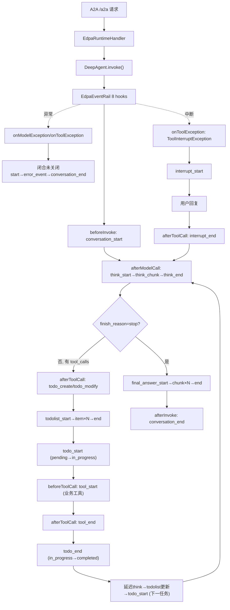

# 转测试设计文档 — EDPA 动态规划思维链特性

> 本文档基于《FEAT_EDPA 动态规划思维链特性用例V1.md》需求文档及 `edp-agent-java` 代码实现编写。仅覆盖与**动态规划**和**思维链**直接相关的测试范围，其他能力（Checkpoint 持久化、熔断降级、Metrics 等）不在本文档范围内。

## 1. 背景与目标

### 背景

- **当前问题**：EDPAgent 原有事件流仅支持 5 种粗粒度事件（todo_start/todo_end/purchase_confirm/error），无法向前端完整呈现智能体"思考→规划→执行→观察→回答"的全过程。
- **影响范围**：前端思维链渲染、用户交互体验、排障可观测性。所有通过 A2A SSE 接入 EDPAgent 的前端客户端均受影响。
- **需求来源**：EDPAgent v1.1 动态规划思维链特性需求，要求通过 SSE 向前端实时推送 **20 种标准化事件**。

### 目标

- **目标 1（思维链）**：实现 20 种标准化事件（`EdpaEventType` 枚举，含 `todo_status`/`tool_status` 预留枚举），通过 SSE 流式推送至前端。
- **目标 2（ReAct 循环）**：实现 ReAct 循环事件序列，每轮 = Think（推理）→ Plan（更新 todolist）→ Act（todo + tool）→ Observe（进入下一轮 Think）。
- **目标 3（事件配对）**：实现 6 类配对规则——`conversation_start↔end`、`think_start↔end`、`tool_start↔end`、`todolist_start↔end`、`todo_start↔end`、`interrupt_start↔end`；异常时"像关括号一样"闭合未关闭的 start。
- **目标 4（异常分类）**：实现 `error_event` 的 6 类 `error_type` 分类（`LLM_TIMEOUT` / `LLM_AUTH_ERROR` / `INVALID_TOOL_OUTPUT` / `TOOL_TIMEOUT` / `DEPENDENCY_VIOLATION` / `INTERNAL_ERROR`），`error_event` 后始终跟 `conversation_end`。
- **目标 5（流适配）**：实现 `EdpaEventStreamAdapter` 将内部 `OutputSchema("custom", ...)` 转为 A2A SSE 帧并抑制重复的 `llm_output` 裸流。

### 非目标（本次不测试）

- Checkpoint Redis 持久化与断线重连完整事件回放（阶段 5 T5.9）。
- 超时/熔断/降级保护机制（阶段 5 T5.4–T5.6），本次仅测试错误事件输出。
- Metrics 事件、WebSocket / 轮询接入方式。

## 2. 测试范围与约束

### 2.1 核心测试场景（与动态规划/思维链强相关）

| 场景 | UC | 触发条件 | 预期事件序列关键点 |
|---|---|---|---|
| 正常对话全链路思维链 | UC-01 | 用户发起涉及多步 Skill 串联的请求 | `conversation_start`→`think`→`todolist`→`todo`→`tool`→…→`final_answer`→`conversation_end` |
| 多步任务动态规划与依赖校验 | UC-02 | `edp-config.yaml` 配置含 `depends_on` 的任务列表 | LLM 选择任务子集，依赖校验通过，拓扑排序生成执行顺序 |
| 任务重新规划 re-plan | UC-03 | LLM 观察结果后追加/调整步骤 | 覆盖式更新 `todolist`，已完成项保留 `completed` 状态 |
| 业务工具调用嵌套 | UC-04 | LLM 决定调用 `call_mcp`/`call_versatile` | `todo_start`→`tool_start`→`tool_status`(可选)→`tool_end`→`todo_end` |
| LLM 推理流式 think\_chunk | UC-05 | `think_start` 已发，LLM 支持流式输出 | `afterModelCall` 发 `think_start`→`think_chunk(content)`→`think_end` |
| 最终回答流式输出 | UC-06 | 所有任务完成，`finish_reason=stop` 且无 `tool_calls` | `final_answer_start`→`chunk`(×N)→`end`→`conversation_end` |
| 追问中断与恢复 | UC-07 | `ask_user` 工具被调用 | `onToolException` 拦截→`interrupt_start`；用户回复后 `interrupt_end` |
| 任务取消终止 | UC-08 | 用户表达终止意图，LLM 调用 `cancel_task` | `cancel_confirm`→用户确认→`task_cancelled`→`conversation_end` |
| LLM 调用超时/失败 | UC-10 | LLM API 不可用或响应超时 | `onModelException`→`error_event(LLM_TIMEOUT/LLM_AUTH_ERROR)`→`conversation_end` |
| 任务依赖冲突检测 | UC-11 | LLM 输出的 todo 列表违反 `depends_on` 约束 | `error_event(DEPENDENCY_VIOLATION)`→`conversation_end` |
| 超范围业务拒绝 | UC-12 | 用户请求超出 `scope.allowed` 范围 | `interrupt_start(out_of_scope)`，不进入 `todolist_start` |
| 多轮对话上下文保持 | UC-14 | 同一 `conversation_id` 发起新请求 | 第二轮引用第一轮结果，已完成步骤保留 `completed` 状态 |

> UC-09（SSE 连接断开）/ UC-13（断线重连）依赖 Checkpoint 持久化（非目标），本次仅做基础回归。

### 2.2 关键规则（直接对应代码注释）

| 规则 | 说明 |
|---|---|
| Rule 1：conversation 配对 | `conversation_start ↔ conversation_end` 1:1；异常路径由 `onModelException`/`onToolException`/`afterInvoke` 兜底闭合 |
| Rule 2：think 严格配对 | 每轮 LLM 推理发一对 `think_start`/`think_end`，由 `thinkOpen` 标志位保证不嵌套不遗漏 |
| Rule 3：think\_end 先于 final\_answer\_start | `finish_reason=stop` 时先发 `think_end`，再发 `final_answer_start` |
| Rule 5：todo 状态转移事件 | `pending/null→in_progress` 发 `todo_start`；`in_progress→completed/done` 发 `todo_end{status:"completed"}`；`in_progress→cancelled` 发 `todo_end{status:"cancelled"}` |
| Rule 6：tool 配对范围 | 仅业务工具（`call_versatile`/`call_mcp`）发 `tool_start`/`tool_end`；`todo_create`/`todo_modify`/`ask_user`/`read_file` 不发 |
| Rule 7：interrupt 跨轮配对 | `onToolException` 拦截 `ToolInterruptException`→`interrupt_start`（本轮末）；下轮 `afterToolCall` 中 `ask_user` 恢复→`interrupt_end` |
| Rule 8：异常不破坏配对 | 所有已打开的 start 必须先发对应 end 关闭，再发 `error_event`，最后 `conversation_end` |
| Rule 10：end 转移 todolist 在 todo\_end 之后 | `in_progress→completed` 时先发 `todo_end`，后发 `todolist_start/item/end` |
| Rule 11：start 转移 todolist 在 todo\_start 之前 | `pending→in_progress` 时先发 `todolist_start/item/end`，后发 `todo_start` |
| Rule 12：todolist 逐条发送 | N 条 todo = N 个 `todolist_item` 事件，每个携带单条 todo（非 `tasks` 数组） |
| 延迟 think 规则 | 当 LLM 本轮只调用 `todo_modify`（无业务工具）时，think 延迟到 `todo_end` 之后发射，使事件流为 `tool_end`→`todo_end`→`think`→`todolist` |
| think\_chunk 内容回退 | `reasoning_content` 仅为标点占位（如 `"."`/`"。"`，length≤1）时视为无数据，回退到 `content`（LLM 实际输出） |

### 2.3 任务状态枚举（对齐 §2.3，事件 payload 一律小写）

| 事件 status 值  | 含义  | 触发时机                                              |
| ------------- | --- | ------------------------------------------------- |
| `pending`     | 待执行 | `todo_create` 批量创建时的非首任务初始态                       |
| `in_progress` | 执行中 | 任务开始执行（`todo_start` 发射时）                          |
| `completed`   | 已完成 | 任务执行完毕（`todo_end` 发射 `status=completed`）          |
| `cancelled`   | 已取消 | 任务被取消或依赖冲突终止（`todo_end` 发射 `status=cancelled`）   |

> `TodoStatus` 枚举另有 `TODO`/`DONE` 两个值，在 EDPAgent 事件流中**不会出现**（见特性文档 §2.3 枚举兼容性说明）。

### 2.4 关键约束

| 约束 | 说明 |
|---|---|
| 传输协议 | 仅 SSE 流式响应（A2A JSON-RPC `/a2a`），不支持 WebSocket/轮询 |
| 事件类型 | 20 种标准化事件（`EdpaEventType` 枚举为唯一来源），禁止字符串字面量 |
| 工具事件范围 | 仅 `call_mcp`/`call_versatile` 发 tool 事件；`ask_user`/`cancel_task`/`skill_tool`/`read_file`/`bash` 不发 |
| Rail 优先级 | `EdpaEventRail` priority=80，低于 `TaskPlanningRail`(90)，保证 `afterToolCall` 读取刷新后的 todo 缓存 |
| 事件顺序保证 | 严格有序，SSE 事件按发射顺序到达前端，不乱序 |
| 非功能指标 | SSE 延迟 ≤100ms；并发 ≥500；对话超时 300s；LLM 超时 60s（重试 3 次）；工具超时 30s |

## 3. 总体方案

### 3.1 链路图



### 3.2 模块分工（仅列与事件链路相关模块）

| 模块 | 职责 |
|---|---|
| `EdpaEventRail`（rail/EdpaEventRail.java） | 统一事件发射 Rail，通过 8 个 hook 拦截全生命周期发射 20 种事件 |
| `EdpaEventStreamAdapter`（enhancer/） | `custom OutputSchema` → A2A SSE 帧；抑制 `llm_output` 重复裸流 |
| `EdpaRuntimeHandler`（handler/） | 运行时入口，创建 DeepAgent、注册 Rail、覆写 resultAdapter |
| `EdpaEventType`（config/） | 事件类型枚举（唯一来源） |
| `EdpaTodoRail`（rail/） | 任务预加载、todo\_create 注入、依赖解析 |
| `McpInterruptRail` / `VersatileInterruptRail`（rail/） | 业务工具执行 + 中断恢复 |

## 4. 关键设计与边界

| 设计点 | 处理方式 | 异常/边界 |
|---|---|---|
| think\_chunk 内容来源 | `afterModelCall` 优先取 `reasoning_content`，length≤1 视为占位符回退到 `content` | 两者均空时跳过 chunk（`think_start`→`think_end` 空对） |
| 延迟 think 发射 | `isOnlyTodoModify` 判定本轮只调 `todo_modify` 时，think 延迟到 `todo_end` 之后 | 兜底：`afterToolCall` 末尾检查 `KEY_PENDING_THINK` 仍未发射则补发 |
| todolist 指纹去重 | `fingerprint(todos)` 对比 `lastTodolistFingerprint`，仅变化时发 | todos 为空时跳过整组事件 |
| todolist 逐条发送 | `emitTodolistPerItem` 发 `start`→`item{单条}`×N→`end` | N 条 todo = N 个 item 事件 |
| todo 状态转移事件 | `hasEnd`（`in_progress`→`completed`/`cancelled`）先发 `todo_end`；`hasStart`（`pending`→`in_progress`）后发 `todo_start` | 路径切换（`pending`→`cancelled`）只发 `todolist`，不发 `todo_start`/`end` |
| error\_type 异常分类 | `classifyModelError`：BaseError.StatusCode → cause 类型 → message 文字匹配 → 兜底 `INTERNAL_ERROR`；`classifyToolError`：timeout/json/depend 文字匹配 | 无法分类时兜底 `INTERNAL_ERROR` |
| ToolInterruptException 中断识别 | `onToolException` 递归检查 cause 链找到被包装的 `ToolInterruptException` | `RuntimeException` 包装的需递归解包 |
| interrupt\_id 生成 | `onToolException` 中 `UUID.randomUUID()`，存入 `interruptIdMap` | 跨轮持久化，`afterToolCall` `interrupt_end` 取出，`afterInvoke` 兜底清理 |
| llm\_output 抑制 | `EdpaEventStreamAdapter.mapResult` 中 `llm_output` 类型返回 null（filter 过滤） | 防止 think\_chunk/final\_answer\_chunk 与裸流文本重复 |
| conversationClosed 防重入 | `emitConversationEnd` 检查 `conversationClosed` 标记 | 异常处理已发则 `afterInvoke` 跳过，避免重复 `conversation_end` |

## 5. 可观测性

| 观测点 | 用途 |
|---|---|
| `[EDPA-DIAG]` 前缀日志（INFO） | 各 hook 入口、事件发射路径追踪，定位事件流偏离点 |
| `[EDPA-DIAG] MODEL_RESPONSE` | 记录 finish\_reason / toolCalls / reasoningPreview / contentPreview / todos，诊断 think\_chunk 内容来源 |
| `[EDPA-DIAG] emitTodoEvents` | todos 数量 / fpChanged / prev / new 指纹，追踪状态转移判定 |
| `EdpaEventRail emit '{}'` | 确认每个事件实际发射的 wireName |
| SSE 事件流（前端收到） | 验证事件配对、顺序、内容 |
| Redis TodoStore | 验证 todo 状态持久化（`completed`/`in_progress`/`pending`） |
| `engine/logs/run/*.log` | 排查失败原因、异常堆栈 |

## 6. 测试建议

### 6.1 测试重点与开发自测门禁（P0）

| 前置/触发条件 | 建议测试重点 | 希望保证的结果 | 建议测试方式 | 门禁 |
|---|---|---|---|---|
| 用户发起涉及多步 Skill 的请求 | UC-01 全链路事件序列 | 20 种事件全部可见，`conversation_start`→…→`conversation_end` 顺序正确 | 端到端 | 是 |
| ReAct 循环（每轮 todo 完成后） | todo\_end 后先 think 再 todolist 再 todo\_start | `todo_end`→`think_start`→`think_chunk`→`think_end`→`todolist_start`→`item`→`end`→`todo_start` | 端到端 | 是 |
| LLM 本轮只调 todo\_modify | 延迟 think 发射 | 事件流为 `tool_end`→`todo_end`→`think`→`todolist` | 集成 | 是 |
| reasoning\_content 为占位符 | think\_chunk 内容回退到 content | `think_chunk.content` = LLM 实际文本输出 | 集成 | 是 |
| LLM 决定调用 call\_mcp/call\_versatile | 业务工具 tool 配对 | `tool_start`{tool,args}→`tool_end`{tool,data} 1:1 | 集成 | 是 |
| LLM 决定调用 ask\_user/skill\_tool/read\_file | 非业务工具不发 tool 事件 | 无 `tool_start`/`tool_end` 出现 | 集成 | 是 |
| 所有任务完成，finish\_reason=stop | final\_answer 流式输出 | `final_answer_start`→`chunk`×N→`end`→`conversation_end` | 端到端 | 是 |
| LLM API 超时/失败 | onModelException 异常处理 | `think_end`（如未闭合）→`error_event`{error\_type}→`conversation_end` | 集成 | 是 |
| 工具抛 ToolInterruptException | onToolException 中断识别 | `interrupt_start`{interrupt\_id}，不发 `error_event` | 集成 | 是 |
| 用户回复后 ask\_user 恢复 | interrupt\_end 配对 | `interrupt_end` 的 interrupt\_id 与 `interrupt_start` 一致 | 端到端 | 是 |

### 6.2 其他测试建议（P1/P2）

| 前置/触发条件 | 建议测试重点 | 优先级 | 建议测试方式 |
|---|---|---|---|
| 任务列表变化（todo\_modify 后） | todolist 逐条发送（Rule 12） | P1 | 集成 |
| 任务列表未变化 | todolist 指纹去重 | P1 | 集成 |
| `pending→in_progress` 状态转移 | todo\_start 发射位置（Rule 11） | P1 | 集成 |
| `in_progress→completed` 状态转移 | todo\_end 发射位置（Rule 10） | P1 | 集成 |
| LLM 输出违反 depends\_on 约束 | 依赖冲突检测（UC-11） | P1 | 集成 |
| 用户请求超出 scope.allowed | 超范围业务拒绝（UC-12） | P1 | 端到端 |
| conversation\_start 时不发跨轮 todolist | Rule 9 验证 | P1 | 集成 |
| llm\_output 抑制 | 前端不收到裸流文本 | P1 | 集成 |
| error\_type 异常分类准确性 | LLM 超时→LLM\_TIMEOUT；401→LLM\_AUTH\_ERROR；工具超时→TOOL\_TIMEOUT；JSON 解析失败→INVALID\_TOOL\_OUTPUT | P2 | 单测 |
| conversation\_end 防重入 | 异常已发后 afterInvoke 不重复发 | P2 | 单测 |

### 6.3 关键异常与边界

- **think\_chunk 占位符回退**：DeepSeek 等模型在 `tool_calls` 模式下 `reasoning_content` 返回 `"."`/`"。"`，必须 length>1 校验后回退到 `content`。
- **ToolInterruptException 被包装**：框架可能将其包装在 `RuntimeException`（"Error invoking rail callback: beforeToolCall"）中，需递归检查 cause 链。
- **TodoTool 不可用兜底**：workspace 未就绪时 `loadCurrentTodos` 回落到 `TaskPlanningRail.cachedTodos` 缓存。
- **interruptActive 跨轮持久化**：`interruptActive`/`interruptIdMap` 不在 `afterInvoke` 中清理，需跨轮配对 `interrupt_start`（本轮）与 `interrupt_end`（下轮）。
- **并发会话隔离**：`lastTodolistFingerprint`/`prevTodoStatus`/`thinkOpen`/`toolOpen`/`conversationClosed` 均以 sessionId 为 key 的 `ConcurrentHashMap`，需验证多会话不串扰。

## 附录

### 附 A：事件类型清单（20 种，对齐 EdpaEventType 枚举）

| # | 事件类型 | wireName | 配对 | 触发 Hook |
|---|---|---|---|---|
| 1 | CONVERSATION_START | conversation_start | ↔conversation_end | beforeInvoke |
| 2 | CONVERSATION_END | conversation_end | ↔conversation_start | afterInvoke / onModelException / onToolException |
| 3 | THINK_START | think_start | ↔think_end | afterModelCall |
| 4 | THINK_CHUNK | think_chunk | 无配对（可多次） | afterModelCall |
| 5 | THINK_END | think_end | ↔think_start | afterModelCall / onModelException |
| 6 | FINAL_ANSWER_START | final_answer_start | ↔final_answer_end | afterModelCall |
| 7 | FINAL_ANSWER_CHUNK | final_answer_chunk | 无配对（可多次） | afterModelCall |
| 8 | FINAL_ANSWER_END | final_answer_end | ↔final_answer_start | afterModelCall |
| 9 | TOOL_START | tool_start | ↔tool_end | beforeToolCall |
| 10 | TOOL_STATUS | tool_status | 无配对（可多次，预留） | — |
| 11 | TOOL_END | tool_end | ↔tool_start | afterToolCall / onToolException |
| 12 | TODOLIST_START | todolist_start | ↔todolist_end | afterToolCall |
| 13 | TODOLIST_ITEM | todolist_item | 无配对（逐条×N） | afterToolCall |
| 14 | TODOLIST_END | todolist_end | ↔todolist_start | afterToolCall |
| 15 | TODO_START | todo_start | ↔todo_end | afterToolCall |
| 16 | TODO_STATUS | todo_status | 无配对（可多次，预留） | — |
| 17 | TODO_END | todo_end | ↔todo_start | afterToolCall |
| 18 | INTERRUPT_START | interrupt_start | ↔interrupt_end | onToolException |
| 19 | INTERRUPT_END | interrupt_end | ↔interrupt_start | afterToolCall |
| 20 | ERROR_EVENT | error_event | 无配对 | onModelException / onToolException |

> 说明：`planning_start` 不作为独立事件类型（对齐 `EdpaEventType` 代码注释：planning 阶段提示由 `think_chunk` 固定帧话术承载）。

### 附 B：error\_type 枚举（6 种）

| error\_type            | 触发场景          | 对应用例          |
| ---------------------- | ------------- | ------------- |
| `LLM_TIMEOUT`          | LLM 调用超时/失败   | UC-10         |
| `LLM_AUTH_ERROR`       | LLM 认证失败（401） | UC-10 AF-10-A |
| `INVALID_TOOL_OUTPUT`  | 工具返回非法 JSON   | UC-04 AF-04-B |
| `TOOL_TIMEOUT`         | 工具执行超时        | UC-04 AF-04-A |
| `DEPENDENCY_VIOLATION` | 任务依赖缺失/循环依赖   | UC-11         |
| `INTERNAL_ERROR`       | 其他未捕获异常       | 兜底            |

### 附 C：正常对话完整事件序列模板

```
conversation_start
think_start → think_chunk(×N) → think_end
todolist_start → todolist_item(×N,逐条) → todolist_end
todo_start (pending→in_progress)
  tool_start (call_mcp/call_versatile)
  tool_status (可选)
  tool_end
  [tool_start → tool_status(可选) → tool_end]
todo_end (in_progress→completed)
think_start → think_chunk(×N) → think_end        ← ReAct 循环
todolist_start → todolist_item(×N,更新) → todolist_end
todo_start
  tool_start → tool_status(可选) → tool_end
todo_end
...（重复 ReAct 循环）
final_answer_start → final_answer_chunk(×N) → final_answer_end
conversation_end
```

### 附 D：参考文档

| 文档 | 路径 |
|---|---|
| 需求文档（特性用例V1） | 01newedpa/FEAT_EDPA 动态规划思维链特性用例V1.md |
| 事件发射 Rail | engine/src/main/java/com/huawei/ascend/edp/rail/EdpaEventRail.java |
| 事件适配器 | engine/src/main/java/com/huawei/ascend/edp/enhancer/EdpaEventStreamAdapter.java |
| 事件枚举 | engine/src/main/java/com/huawei/ascend/edp/config/EdpaEventType.java |
| 运行时入口 | engine/src/main/java/com/huawei/ascend/edp/handler/EdpaRuntimeHandler.java |

### 附 E：本次修订记录（对齐特性文档 V1）

基于《FEAT_EDPA 动态规划思维链特性用例V1.md》及 `EdpaEventType` 源码对本文档进行刷新，主要变更如下：

| # | 章节 | 变更类型 | 变更内容 |
| - | --- | ---- | --- |
| 1 | §1 背景/目标 | 正确性 | 事件总数由 "21/22 种" 统一为 **20 种**（对齐 `EdpaEventType` 枚举定义） |
| 2 | §1 目标 1 | 精简 | 删除 "planning_start per-request 去重" 等无关规则；明确 6 类配对规则 |
| 3 | §1 非目标 | 精简 | 合并为 3 条（Checkpoint/熔断降级/Metrics+WebSocket） |
| 4 | §2.1 场景表 | 精简 | 从 14 行精简到 12 行，剔除 UC-09/UC-13（依赖 Checkpoint，本次仅基础回归） |
| 5 | §2.2 关键规则 | 正确性 | 删除错误的 "Rule 9/Rule 12 planning\_start 去重" 规则；状态值改为小写 |
| 6 | §2.3 任务状态枚举 | 新增 | 新增事件 status 值表（4 个小写状态：`pending`/`in_progress`/`completed`/`cancelled`），说明 `TODO`/`DONE` 不会出现 |
| 7 | §2.4 关键约束 | 精简 | 合并非功能指标为一行；删除冗余条目 |
| 8 | §3 总体方案 | 精简 | 删除"方案概述"文字段（链路图自解释）；模块分工表删除"输入/输出"列 |
| 9 | §4 关键设计 | 正确性 | 状态转移描述改为小写（`in_progress`→`completed`/`cancelled`） |
| 10 | §5 可观测性 | 精简 | 删除"日志/指标/状态"列，合并为单列"用途"；Redis 说明改为 TodoStore |
| 11 | §6.1/6.2 测试建议 | 精简 | 原 20+ 行单表拆为 **P0 门禁**（10 行）+ **P1/P2 补充**（10 行），优先级清晰 |
| 12 | §6.3 异常与边界 | 精简 | 删除"EdpaEventStreamAdapter null 过滤""conversationClosed 清理时机"（与 §4 重复） |
| 13 | 附 A 事件清单 | 正确性 | 删除 planning\_start（原#3）；20 种事件重新编号；新增"planning\_start 不作为独立事件"说明 |
| 14 | 附 B/C/D | 结构调整 | 合并 error\_type 枚举与序列模板到附录；参考文档表精简路径 |
| 15 | 全文 | 一致性 | 状态值统一为事件 payload 实际输出的小写形式（对齐 `EdpaEventRail.toTaskMap()` 的 `.name().toLowerCase()`） |

>   本次修订依据  ：

>   -   事件总数 20 种 —— [EdpaEventType.java](file:///d:/02AKDI/05jiuwenjava/01code/0708temp/01newedpa/common/agent/edp-agent-java/engine/src/main/java/com/huawei/ascend/edp/config/EdpaEventType.java) 枚举定义 + 类注释"共 20 种事件类型""planning\_start 不作为独立事件类型"
>   -   状态值小写 —— [EdpaEventRail.java](file:///d:/02AKDI/05jiuwenjava/01code/0708temp/01newedpa/common/agent/edp-agent-java/engine/src/main/java/com/huawei/ascend/edp/rail/EdpaEventRail.java) `toTaskMap()` 中 `todo.getStatus().name().toLowerCase()`
>   -   状态枚举 4 态 —— 特性用例 V1 §2.3 任务状态枚举（附录 G 勘误记录）
